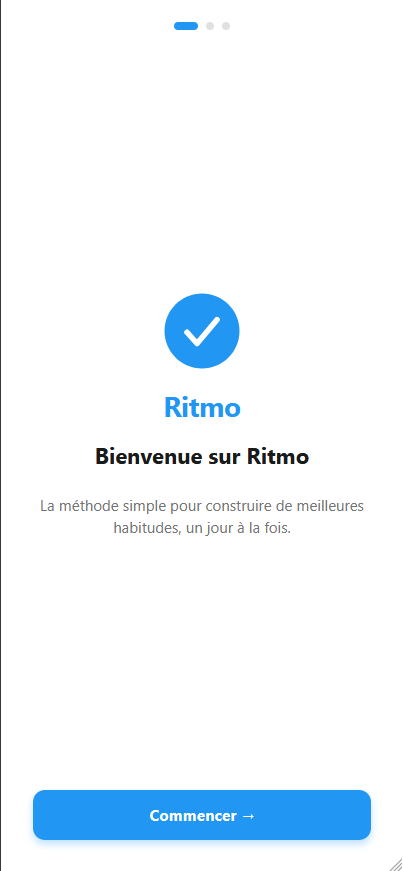
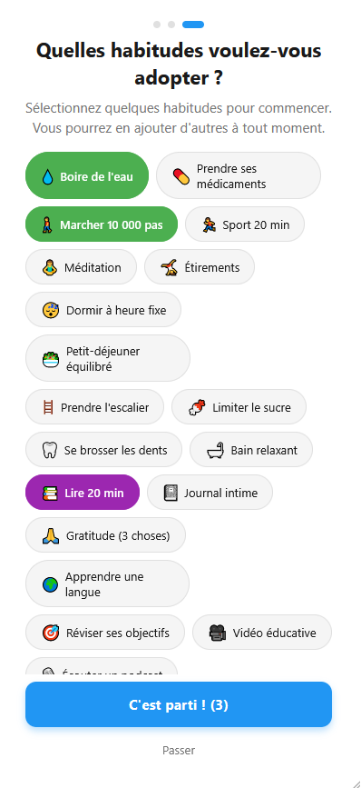
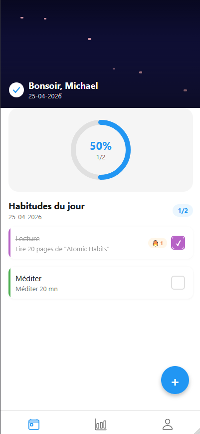

# Ritmo - Habit Tracker

A mobile habit tracking app built with React Native and Expo.
Create habits, track your daily progress, and build consistency over time.

---

## Screenshots

<p align="center">
  
  
  
  
</p>

---

## Features

- Onboarding flow with habit suggestions
- Create custom habits with categories, frequency and reminders
- Daily progress tracking with circular progress indicator
- Streak system with fire indicator 🔥
- Confetti animation on daily completion
- Push notifications
- Multi-language support (i18n)
- Firebase authentication & data persistence
- Offline-first state management with Zustand

---

## Stack

| Layer      | Technology                        |
|------------|-----------------------------------|
| Framework  | Expo (React Native)               |
| Language   | TypeScript                        |
| State      | Zustand                           |
| Backend    | Firebase (Auth + Firestore)       |
| Animations | Lottie                            |
| i18n       | expo-localization                 |
| Build      | EAS Build                         |

---

## Getting Started

### Prerequisites

- Node.js 18+
- Expo CLI
- iOS Simulator, Android Emulator, or Expo Go

### Installation

```bash
git clone https://github.com/MTDev2024/habit-app.git
cd habit-app
npm install
```

### Firebase Setup

1. Create a project on [Firebase Console](https://console.firebase.google.com)
2. Enable Firestore and Authentication (Email/Password)
3. Download `google-services.json` and place it at the root

### Run

```bash
npx expo start
```

Press `i` for iOS simulator · `a` for Android emulator

---

## Project Structure

```
habit-app/
├── app/          # Expo Router screens
├── components/   # Reusable UI components
├── store/        # Zustand state management
├── services/     # Firebase services
├── hooks/        # Custom hooks
├── locales/      # i18n translation files
├── constants/    # App constants
└── utils/        # Utility functions
```

---

## Author

Michael Takbou · [LinkedIn](https://www.linkedin.com/in/michael-takbou/) · [Malt](https://www.malt.fr/profile/michaeltakbou)
